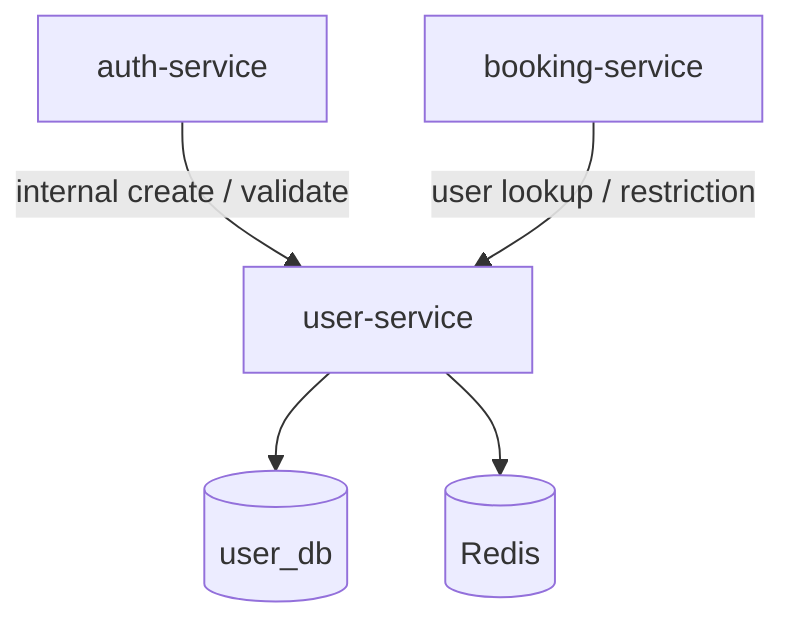

# user-service

User profiles, registration approval, restrictions, and internal credential APIs for the [Library Booking System](https://github.com/LibraryBookingSystem/Documentation). Consumed by **auth-service** at login/register time and by **booking-service** when enforcing account state.

## Role in the system



Public routes are exposed through **api-gateway** at `/api/users`. Internal routes under `/api/users/internal` are intended for service-to-service calls only.

## API (via gateway)

Base path: `http://localhost:8080/api/users`

| Area | Examples |
| --- | --- |
| Self-service | `GET /me` |
| Admin / faculty | `GET /`, `GET /pending`, `POST /{id}/approve`, `POST /{id}/reject` |
| Moderation | `POST /{id}/restrict`, `POST /{id}/unrestrict`, `GET /{id}/restricted` |
| Discovery | `GET /search`, `GET /username/{username}` |

Internal (not for browsers): `POST /internal/create`, `POST /internal/validate`.

Health: `GET /api/health` on the service (port 3001).

Role requirements are documented in [AUTHORIZATION.md](https://github.com/LibraryBookingSystem/Documentation/blob/main/AUTHORIZATION.md).

## Stack

- Java 17, Spring Boot 3.5
- Spring Data JPA (PostgreSQL), Redis starter, AMQP
- Spring Security, AOP, JJWT
- gRPC server port configured (`GRPC_PORT`, default **50051**); HTTP remains the primary integration path in the current codebase
- [common-aspects](https://github.com/LibraryBookingSystem/common-aspects)

## Configuration

| Variable | Default | Purpose |
| --- | --- | --- |
| `DB_HOST` / `DB_PORT` / `DB_NAME` | `localhost` / `5433` / `user_db` | PostgreSQL |
| `DB_USER` / `DB_PASSWORD` | `postgres` / `postgres` | Database credentials |
| `REDIS_HOST` / `REDIS_PORT` | `localhost` / `6379` | Redis |
| `RABBITMQ_*` | `localhost:5672`, user `admin` | Messaging |
| `GRPC_PORT` | `50051` | gRPC listener |
| `JWT_SECRET` / `JWT_EXPIRATION` | see `application.yaml` | Token validation on protected routes |

HTTP port **3001**.

## Run locally

**With Docker Compose (recommended):**

```powershell
cd docker-compose
docker compose up -d user-service
```

**Standalone:** PostgreSQL with database `user_db`, then:

```bash
mvn spring-boot:run
```

## Related repositories

- [auth-service](https://github.com/LibraryBookingSystem/auth-service) — JWT issuance
- [booking-service](https://github.com/LibraryBookingSystem/booking-service) — booking ownership and restriction checks
- [Documentation](https://github.com/LibraryBookingSystem/Documentation) — API and authorization reference
